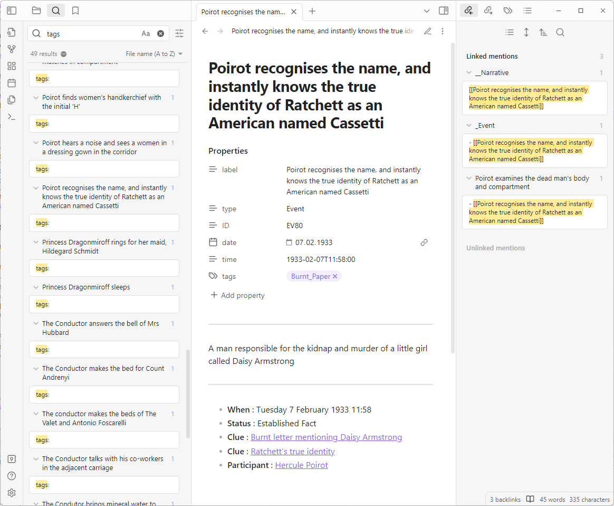

The *aeon3obsidian* Python script extracts the items of an [Aeon Timeline 3](https://timeline.app/) 
project and generates a set of Markdown documents.



## Features

- Creates a page for each *aeon* item. 
- Creates links between the pages according to the relationships. 
- Inserts tags, if any. 
- Inserts date/time (Gregorian date, "A.D." only) for the event-based pages. 
- Inserts duration (as set in Aeon) for the event-based pages. 
- The `__index.md` file holds the table of contents on the top level. 
- The `__narrative.md` file holds the table of contents of the narrative. 

## Requirements

- [Python](https://www.python.org/) version 3.6+.

**Aeon Timeline 2 users:** A variant for Aeon Timeline 2 can be found [here](https://peter88213.github.io/aeon2obsidian/).

## Download and install {#download}

[Download the latest release (version 1.0.5)](https://raw.githubusercontent.com/peter88213/aeon3obsidian/main/dist/aeon3obsidian_v1.0.5.zip)

- Unpack the zipfile and copy *aeon3obsidian.py* whereever you want.

[Changelog](changelog)

## Usage

```
aeon3obsidian.py Sourcefile

positional arguments:
  Sourcefile  The path of the .aeon file.

```

You can also drag an *.aeon* file and drop it on the *aeon3obsidian.py* icon. 

The created Markdown files are placed in a subfolder, named after the *aeon* project.

### Troubleshooting

The *aeon3obsidian.py* script should create a folder that contains a whole set of *.md* files. This folder should be found in the same directory where your *.aeon* file is located. If your .aeon file path is for example "c:\Users\Snoopy\Documents\my timeline.aeon", the folder containing the *.md* files is "c:\Users\Snoopy\Documents\my timeline". 

Please make sure that all requirements are met. Drag/drop only works if Python is properly installed on your computer, so that *aeon3obsidian.py* is recognized by your operating system as a Python script. 

The *aeon3obsidian.py* icon should look like this: 


Which Python version have you installed?

In case of doubt, please start the *aeon3obsidian.py* script from the text console, so you get an error message that might help.


## License

This extension is distributed under the [MIT
License](http://www.opensource.org/licenses/mit-license.php).

